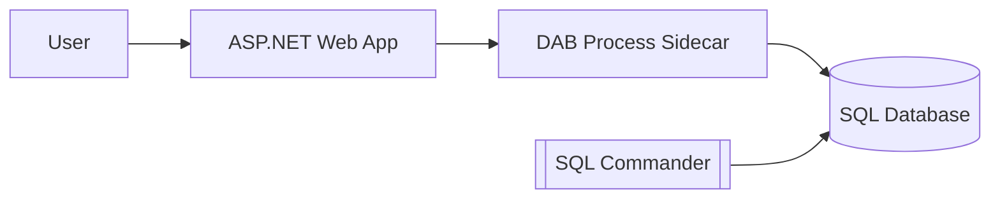
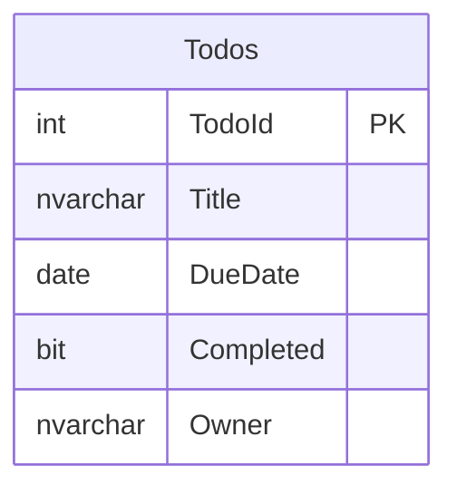

# Quickstart 7: DAB Process Sidecar

This deployment quickstart shows a simple ASP.NET site that starts Data API builder as a process sidecar. DAB is not deployed as its own container. The web app includes `dab-config.json`, starts `dab start`, and then uses DAB as the API layer for SQL.

This is not an auth quickstart. It defaults to SQL username/password authentication so the sidecar hosting pattern is easy to see.

## What You'll Learn

- Run DAB from an ASP.NET app as a child process
- Keep DAB as the API/MCP layer for SQL
- Use Aspire to host SQL Server and deploy the database project locally
- Deploy a single ASP.NET container that includes the DAB CLI

## Architecture



## Auth Matrix

| Hop | Auth |
|-----|------|
| User → Web | Anonymous |
| Web → DAB | Same-origin proxy |
| DAB → SQL local | SQL Auth |
| DAB → SQL Azure | SQL Auth |

## Prerequisites

- [.NET 10 or later](https://dotnet.microsoft.com/download)
- [Docker Desktop](https://www.docker.com/products/docker-desktop/)
- [Data API Builder CLI](https://learn.microsoft.com/azure/data-api-builder/) — restored by `dotnet tool restore`
- [PowerShell](https://learn.microsoft.com/powershell/scripting/install/installing-powershell)

> Run `dotnet tool restore` to install DAB `2.0.9` and SqlPackage from the included tool manifest.

## Run Locally

```bash
dotnet tool restore
dotnet run --project aspire-apphost
```

Aspire dashboard opens at `http://localhost:15888`. The web app is at `http://localhost:5173`.

The web app starts DAB automatically. The UI includes a **Data API builder sidecar** panel with links to:

- `/swagger/`
- `/graphql/`
- `/health`
- `/api/Todos`
- `/mcp`
- `/embed/`

## Deploy to Azure

```bash
pwsh ./azure-infra/azure-up.ps1
```

This provisions Azure SQL, Azure Container Apps, ACR, and SQL Commander. The ASP.NET web image installs the DAB CLI and starts DAB as a child process inside the web app container.

To tear down resources:

```bash
pwsh ./azure-infra/azure-down.ps1
```

## Database Schema



## Reusable DAB service

The sidecar lifecycle lives in `web-app/Services/DataApiBuilderService.cs`. It is intentionally demo-agnostic so developers can copy it into their own ASP.NET projects.

See [`docs/dab-service.md`](docs/dab-service.md) for the developer guide.
